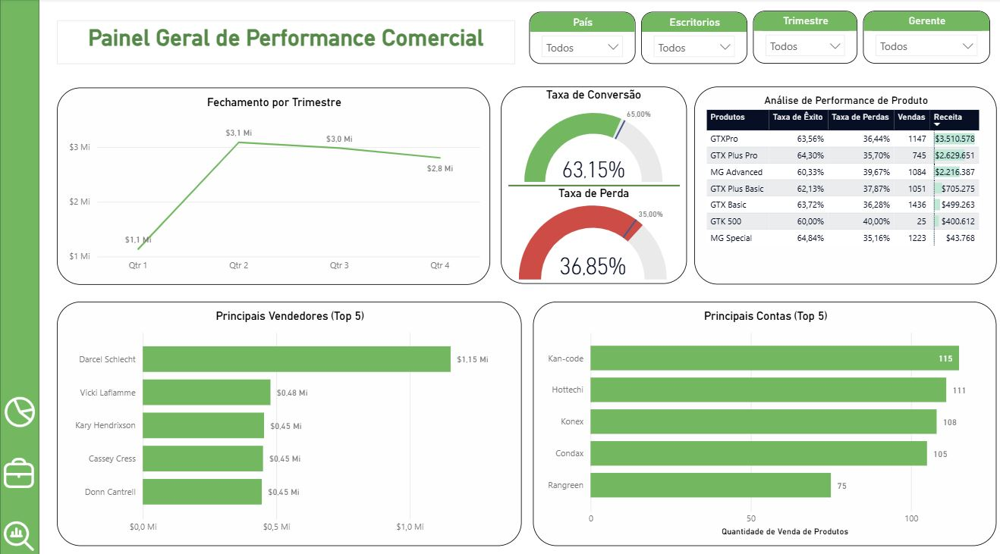
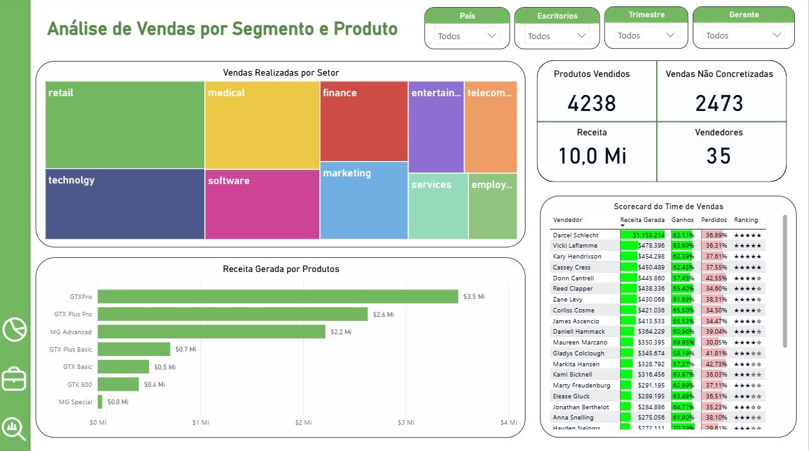
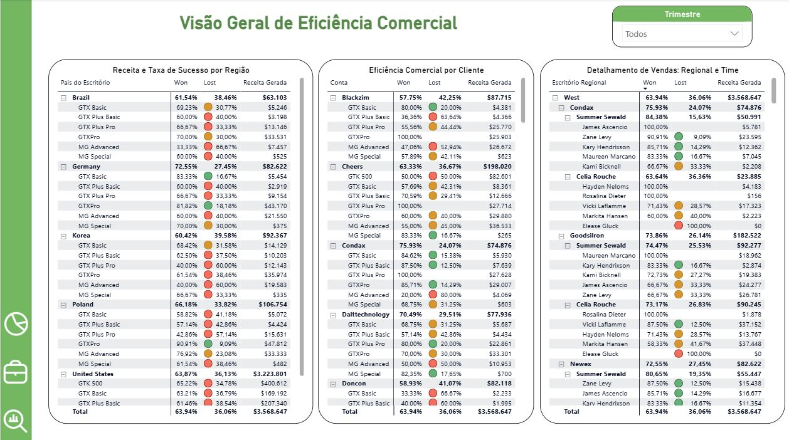

# Análise de Performance Comercial - CRM Sales Opportunities
Este repositório contém o desenvolvimento de um dashboard interativo no Power BI focado na análise de dados de CRM. O projeto transforma dados brutos de oportunidades de vendas em insights acionáveis sobre eficiência comercial, performance de produtos e produtividade da equipa.

Os dados utilizados foram extraídos da plataforma Maven Analytics, referentes à base de dados CRM Sales Opportunities.

# 📊 Estrutura do Relatório
O projeto está dividido em três visões principais, conforme as imagens no repositório:

**Painel Geral de Performance:** Visão macro com KPIs de conversão, tendências trimestrais de fechamento e ranking dos principais vendedores e contas.

<p align="center">
  <b>Visão 1: Painel Geral de Performance</b><br>
  
</p>

**Análise de Vendas por Segmento e Produto:** Detalhamento do mix de produtos e setores (Treemap), volume de receita por categoria e um scorecard detalhado do time de vendas.

<p align="center">
  <b>Visão 2: Análise de Vendas por Segmento e Produto</b><br>
  
</p>

**Visão Geral de Eficiência Comercial:** Análise granular de ganhos e perdas por região, cliente e gerente de conta.

<p align="center">
  <b>Visão 3: Visão Geral de Eficiência Comercial</b><br>
  
</p>


# 🛠️ Tecnologias e Técnicas Utilizadas
**Ferramenta:** Power BI Desktop.

**Linguagem:** DAX (Data Analysis Expressions) para métricas de negócio.

**ETL:** Power Query para limpeza e modelagem dos dados.

**Data Viz:** Utilização de indicadores visuais dinâmicos (Star Rating) e filtros contextuais.

# 🧮 Inteligência de Dados (Métricas DAX)
Para este projeto, foram desenvolvidas medidas personalizadas para responder a desafios específicos de negócio. Abaixo estão os principais destaques:

Taxa de Conversão (Won %)
Calcula a percentagem de sucesso nas negociações finalizadas.

```
Won = DIVIDE(
    CALCULATE(COUNTROWS(Pipeline_de_vendas), Pipeline_de_vendas[Estágio do Negociação] = "Won"), 
    [Total Negociacoes]
)
```
Eficiência por Produto
Mede o aproveitamento das oportunidades de cada produto.

```
Eficiência = DIVIDE([Vendas por Produto], [Vendas por Produto] + [Vendas nao feita por Produto], 0)
```
Classificação Visual de Performance (Star Rating)
Implementação de um ranking dinâmico de 5 estrelas para visualizar o desempenho de vendas por vendedor.

```
Classificação por estrelas Total Vendas = 
VAR __MAX_NUMBER_OF_STARS = 5
VAR __MIN_RATED_VALUE = 0
VAR __MAX_RATED_VALUE = 500000
VAR __BASE_VALUE = [Total Vendas]
VAR __NORMALIZED_BASE_VALUE =
	MIN(
		MAX(
			DIVIDE(
				__BASE_VALUE - __MIN_RATED_VALUE,
				__MAX_RATED_VALUE - __MIN_RATED_VALUE
			),
			0
		),
		1
	)
VAR __STAR_RATING = ROUND(__NORMALIZED_BASE_VALUE * __MAX_NUMBER_OF_STARS, 0)
RETURN
	IF(
		NOT ISBLANK(__BASE_VALUE),
		REPT(UNICHAR(9733), __STAR_RATING)
			& REPT(UNICHAR(9734), __MAX_NUMBER_OF_STARS - __STAR_RATING)
	)
```


# 📈 Principais Insights Extraídos
Identificação do GTXPro como o produto líder em receita ($3.5M), apesar de possuir uma taxa de conversão ligeiramente inferior a outros modelos.

Destaque para o setor de Retail (Varejo) como a principal fonte de oportunidades concretizadas.

Visualização clara da sazonalidade, com o Q2 apresentando o maior volume de fechamento ($3.1M).
